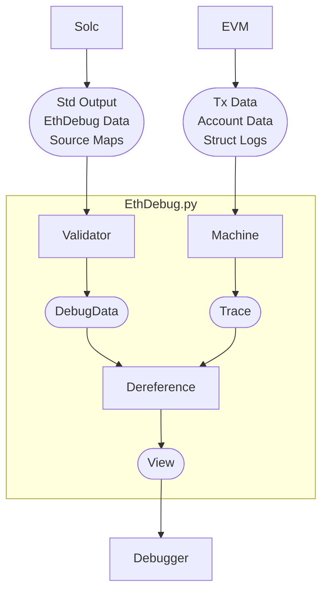

# EthDebug.py

EthDebug.py is a library offering debugging primitives that are commonly used by
developer tools, such as breakpoint-style debuggers, testing frameworks or static analzers/linters. Notably, it includes a complete debugger-side implementation of the EthDebug format. The main function is reading Solidity runtime information (like local variables) from a running Ethereum Virtual machine.

Thinks you can do with EthDebug.py:
- Read the value of a Solidity variable at a paused machien state
- See which variables are in scope at a specific source location
- Provide better log- and error-messages by replacing unreadable EVM details with their human-readable Solidity counterparts

This library is agnostic of any specific virtual machine implementation and compiler. The following diagram shows the relationship between the different 

# Goals and Non-Goals

- Improve ecosystem-wide developer experience by providing a rich set of debugging primitives
- Provide feedback on the specification and implementation of the EthDebug format
- Assist compilers when implementing counter-part of the EthDebug protocol
- It's explitly beyond the scope of this project to develop a fully-featured stand-alone debugger. For a debugger that uses this library see [Simbolik](https://simbolik.runtimeverification.com/). In fact, this library used be a part of Simbolik, but has since been extracted into it's own project.

# Usage

The project contains parsers and validators for all EthDebug schemas.
Each subschema has it's corresponding Pydantic model defined under the `src/ethdbeug/format` folder. These models are auto-generated directly from the spec and kept up to date as the spec evolves.

Under `src/ethdebug/dereference` the library offers a complete pointer dereferencing algorithm. This algorithm is a rewrite of the TypeScript reference-implementation in Python.

The `tests/folder` contains all sorts of automatic tests. Some tests are ported from the reference implementation to ensure consistency. Other tests are specifically developed to test the integration witht the Solidity compiler. The latter have revealed

# For Devs

## Regenerating the validators

The data models used for parsing and validating the EthDebug format are generated from the JSON schema using the `generate_model.py` script.
The files should be regenerated when the JSON schema files change, or when the datamodel-code-generator library is updated.

~~~bash
uv run python ./generate_model.py 
~~~

The datamodel-code-generator library we use to generate the validators has some custom changes to make it work with the EthDebug JSON schema files.
The library is therefore embedded as a subtree in the `datamodel-code-generator` directory.
To update the library, you can run the following command:

~~~bash
git subtree pull --prefix=datamodel-code-generator git@github.com:koxudaxi/datamodel-code-generator.git main --squash
~~~

## Using solc to generate standard json output files

~~~bash
pushd tests && solc --standard-json mega_playground/input.json > mega_playground/output.json && popd
pushd tests && solc --standard-json abstract_and_interface/input.json --pretty-json > abstract_and_interface/output.json && popd
pushd tests && solc --standard-json standard_yul_debug_info_ethdebug_compatible_output/input.json > standard_yul_debug_info_ethdebug_compatible_output/output.json --allow-paths . && popd
~~~