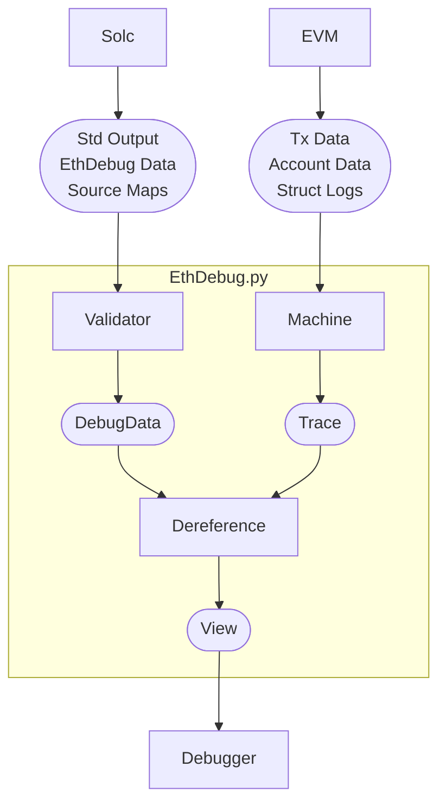

<div align="center">

# 🐞 EthDebug.py

> A Python library of debugging primitives for Ethereum developer tools — breakpoint debuggers, testing frameworks, and static analyzers.

[](https://discord.gg/CurfmXNtbN)
[](LICENSE)

</div>

EthDebug.py includes a complete debugger-side implementation of the [EthDebug format](https://ethdebug.github.io/format/). Its core capability is reading Solidity runtime information (such as local variables) from a running Ethereum Virtual Machine.

**What you can do with EthDebug.py:**

- Read the value of a Solidity variable at a paused machine state
- See which variables are in scope at a specific source location
- Replace unreadable EVM details with their human-readable Solidity counterparts in logs and error messages
- Work in Progress: Generate ethdebug data for existing compilation units

---

## Architecture

This library is agnostic of any specific virtual machine implementation and compiler. The diagram below shows how the components relate:


```mermaid
flowchart TD
    Solc
    subgraph EthDebug.py
        Validator
        Machine
        Dereference
        Trace@{ shape: stadium}
        DebugData@{ shape: stadium}
        View@{shape: stadium}
    end
    EVM
    Debugger
    SolcOutput@{ shape: stadium, label: "Std Output\n EthDebug Data\nSource Maps"}
    Solc --> SolcOutput-->Validator
    EVMOutput@{ shape: stadium, label: "Tx Data\nAccount Data\nStruct Logs"}
    EVM -->EVMOutput-->Machine
    Validator-->DebugData-->Dereference
    Machine-->Trace-->Dereference
    Dereference-->View-->Debugger
```

---

## Goals and Non-Goals

| | |
|---|---|
| ✅ | Improve ecosystem-wide developer experience by providing a rich set of debugging primitives |
| ✅ | Provide feedback on the specification and implementation of the EthDebug format |
| ✅ | Assist compilers when implementing the counterpart of the EthDebug protocol |
| ❌ | Develop a fully-featured stand-alone debugger — see [Simbolik](https://simbolik.runtimeverification.com/) for that (this library was originally extracted from Simbolik) |

---

## API Docs

The [Project Structure](#project-structure) section provides a high-level overview of the provided modules. Inside each module you'll find extensive pydoc comments detailing how it is meant to be used.

For concrete usage examples, the tests are a good starting point.

### Project Structure

| Module | Description |
|---|---|
| `src/ethdebug/format` | Parsers and generators for all EthDebug schemas. Structure mirrors the sub-schema hierarchy. Auto-generated from the spec and kept in sync as it evolves. |
| `src/ethdebug/evaluate.py` | Data structures and algorithms for evaluating pointers in the context of a paused machine state. Note: "evaluating" is distinct from "dereferencing." |
| `src/ethdebug/dereference` | Complete pointer dereferencing algorithm. A Python rewrite of the TypeScript reference implementation, with support for all pointer regions, collections, expressions, and templates. |
| `src/ethdebug/cursor.py` | Defines the result of dereferencing a pointer. |
| `src/ethdebug/data.py` | Low-level primitives for converting between data representations (e.g. raw bytes ↔ unsigned integers). |
| `src/ethdebug/machine.py` | Abstract protocols `Machine`, `MachineTrace`, and `MachineState`. Users of the library implement these to integrate their own EVM. |
| `tests/` | Automated tests. Some are ported from the reference implementation to ensure consistency; others test integration with the Solidity compiler. |

---

## EthDebug Annotation Tool

> **Work in Progress:** The annotator is under active development and not yet feature-complete. Expect gaps in coverage, breaking changes, and incomplete output.

The solc compiler does not yet generate EthDebug data, but the annotation tool can be used to add it to existing solc output. This is useful for testing and prototyping while compiler support is in progress.
It can also be used as backwards-compatibility layer for tools that want to support EthDebug but rely on solc output.

```bash
# Compile
solc --standard-json < input.json > output.json

# Annotate
python -m annotator output.json -o annotated.json

# Pipeline
solc --standard-json < input.json | python -m annotator > annotated.json
```

Run `python -m annotator --help` for full CLI options.

---

## For Contributors and Maintainers

### Regenerating the Validators

The data models for parsing and validating the EthDebug format are generated from the JSON schema using `generate_model.py`. Regenerate them whenever the JSON schema files change or `datamodel-code-generator` is updated:

```bash
uv run python ./generate_model.py
```

> **Note:** The `datamodel-code-generator` library has custom patches to work with the EthDebug JSON schema files and is embedded as a subtree in the `datamodel-code-generator/` directory. To update it:
>
> ```bash
> git subtree pull --prefix=datamodel-code-generator git@github.com:koxudaxi/datamodel-code-generator.git main --squash
> ```

### Generating Test Fixtures with `solc`

```bash
pushd tests && solc --standard-json mega_playground/input.json > mega_playground/output.json && popd
pushd tests && solc --standard-json abstract_and_interface/input.json --pretty-json > abstract_and_interface/output.json && popd
pushd tests && solc --standard-json standard_yul_debug_info_ethdebug_compatible_output/input.json > standard_yul_debug_info_ethdebug_compatible_output/output.json --allow-paths . && popd
```
